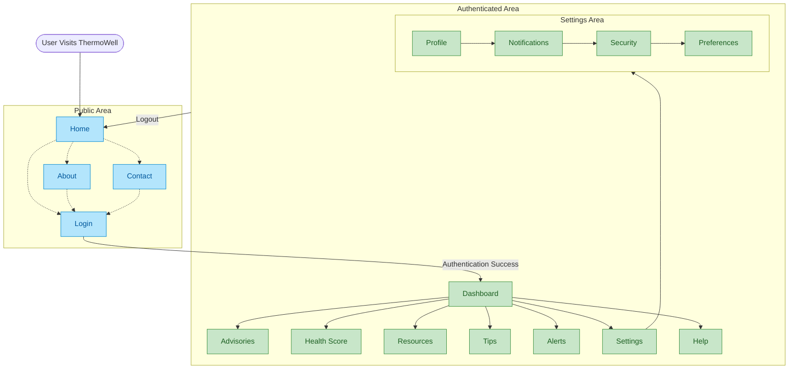

```mermaid
flowchart TB
    classDef publicPage fill:#b3e5fc,stroke:#0288d1,color:#01579b
    classDef authPage fill:#c8e6c9,stroke:#388e3c,color:#1b5e20

    Start([User Visits ThermoWell]) --> HomePage
    
    subgraph PublicArea["Public Area"]
        direction TB
        HomePage[Home] -.-> AboutPage[About]
        HomePage -.-> ContactPage[Contact]
        HomePage -.-> LoginPage[Login]
        AboutPage -.-> LoginPage
        ContactPage -.-> LoginPage
    end
    
    subgraph AuthArea["Authenticated Area"]
        direction TB
        Dashboard --> Advisories
        Dashboard --> HealthScore[Health Score]
        Dashboard --> Resources
        Dashboard --> Tips
        Dashboard --> Alerts
        Dashboard --> Settings
        Dashboard --> Help
        
        subgraph SettingsArea["Settings Area"]
            Profile --> Notifications
            Notifications --> Security
            Security --> Preferences
        end
        
        Settings --> SettingsArea
    end
    
    LoginPage -->|Authentication Success| Dashboard
    AuthArea -->|Logout| HomePage
    
    %% Apply styles
    class HomePage,AboutPage,ContactPage,LoginPage publicPage
    class Dashboard,Advisories,HealthScore,Resources,Tips,Alerts,Settings,Help,Profile,Notifications,Security,Preferences authPage
```
